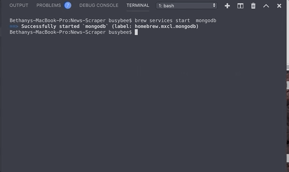

# News-Scraper
NPR news articles, easily accessible for the user. User has the ability to comment on the articles, as well as save them in a Saved Artcles tab on the webpage.

### Getting Started (on your local machine)
```
- Must have Node.js and MongoDB installed locally
- In your CLI, enter mongod
- In a new CLI window, go to root of directory and enter node server.js
- In browser, navigate to http://localhost:3000
```
#### Dependencies: must npm install the following node modules:
```
- express
- express-handlebars
- mongoose
- body-parser
- cheerio
- request
```



#### Heroku Deployment:
https://zimmer-news.herokuapp.com/
> Heroku deployment not (yet!) functioning.  Need to review the installed dependencies.
